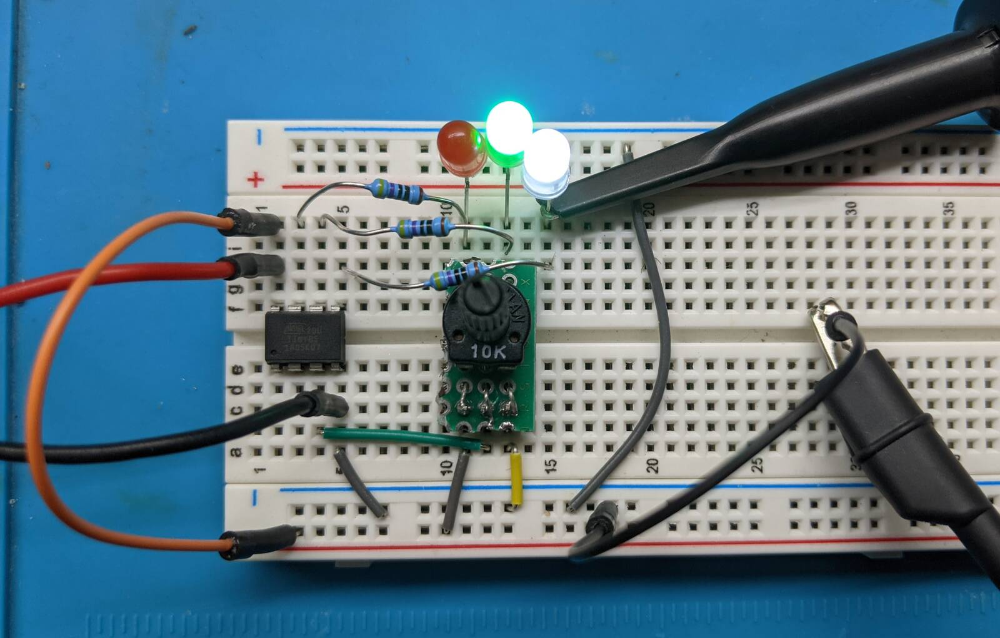
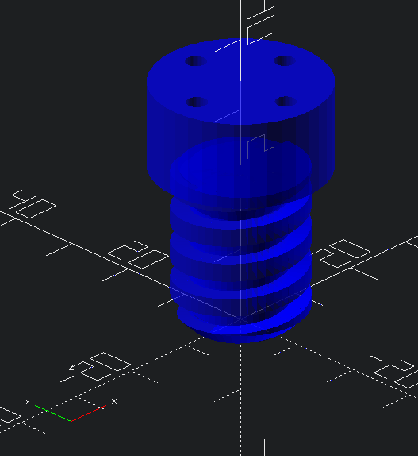
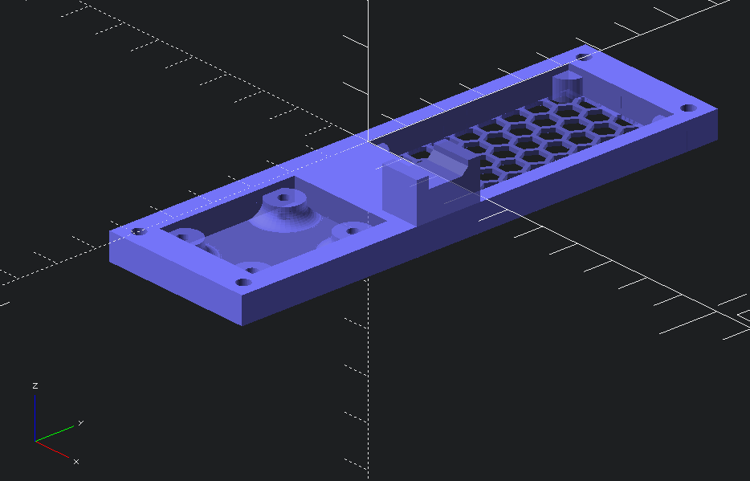
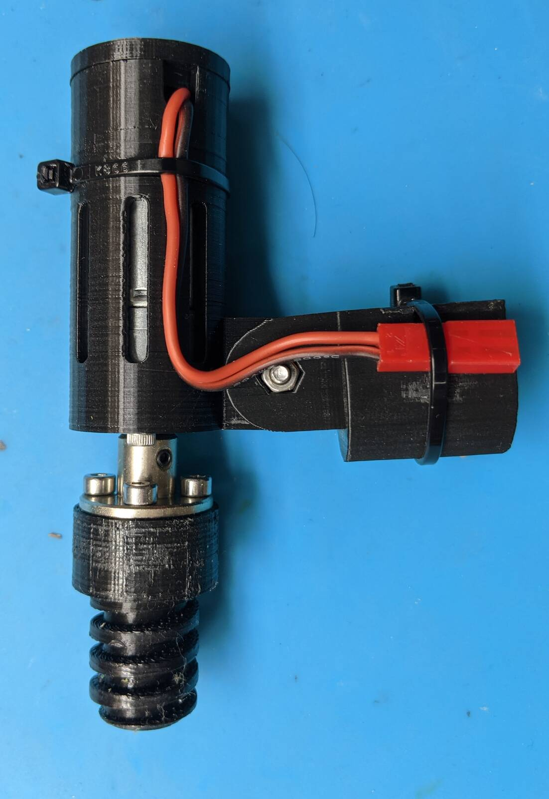

# Light Bulb Changer

_Note: I also made a [video describing the project](https://youtu.be/A-EdzPTZSjM)._

Do you have hard-to-reach light bulbs?  If so, then you are perhaps familiar a
_Light Bulb Changer_.  It threads on the end of a pole and extends your reach. 
A problem is one of mechanics.  If you can't get your pole square to the bulb,
the effectiveness of the holder decreases rapidly.  Imagine trying to use
this thing at a 90 degree angle to the bulb.  That is the exact situation I
found myself in: 

OK. Just get a tall ladder, move that table, make that suspicious call
confirming my life insurance details and up I go.  Just kidding, I instead
used this as an excuse for another maker project.

I spent way more time on this than the ladder would have taken.  Then again, it
was quite a bit of fun and now I have a useful tool on-hand ready to square off
against the next light bulb challenge.  Lucky for you, all of the design,
modeling, and testing steps are done so you can build one in a fraction of the time.
Heck, I even include a walkthrough below.

Of course if you want extra challenge, feel free to mod up the design below to
match your favorite parts and techniques.  Have it play inspirational music, add
Bluetooth for some reason... Your imagination, skill, time and budget are your
only limits.

If you don't have a 3D printer, hope is not lost.  You can always use a project
box, parts from the hardware store and plenty of zip ties to get things done old
school.

## Step 1: Parts

Here is what I built:

The middle unit is a motorized driver that the light bulb changer screws onto.
It then screws on a pole.  Now you have both a motor and a way to change the
angle.  There is also a control box that goes on the other end of the pole.

### Parts I used include:

   1. **[Geared brushed motor](https://www.amazon.com/gp/product/B0728HDH45)**.  These
      are around $13 on Amazon, probably cheaper other places.  I went with 200
      RPM which is a bit more than 3 rotations/second at 12V.  This seemed about
      right.
   2. **[Flange Coupling Connector](https://smile.amazon.com/gp/product/B07PDYV4P3)**. 
      This is needed to adapt the motor's shaft to the _Light Bulb Changer_.
   3. **Microcontroller**. I went with the [ATTiny85](https://www.sparkfun.com/products/9378)
      Loading firmware on it can be tricky if you have not done so before.  But there are
      dozens of video and written guides on the internet on how to do it.  Once you
      get it working the first time, it will be turn key after that.
   4. **[L293D](https://www.adafruit.com/product/807) H-bridge motor driver**.
      This turns the puny waveforms the ATTiny85 can generate into power boosted
      energy waves that can drive a motor at variable speeds and in either forward
      or reverse.
   5. **Broomstick** for mounting
   6. **[Enough wire](https://www.amazon.com/BNTECHGO-Flexible-Conductor-Resistant-Extension/dp/B077X9MVWG)**
      to reach all the way down the broomstick.
   7. **Zipties** to secure the control module to the broomstick.
   8. **[Sony PS2 thumbstick](https://www.amazon.com/HiLetgo-Controller-JoyStick-Breakout-Arduino/dp/B00P7QBGD2)**
      which is basically a thumb-friendly potentiometer. Any 10k potentiometer will work,
      so long as you can handle the ergonomics.
   9. **A power source**.  You'll need around 12V and enough current to keep the motor
      happy.  A [3S lipo battery](https://www.amazon.com/TATTU-Battery-650mAh-Torrent-Lizard/dp/B071GBGBB4)
      (450-1800 mAh) fits this bill perfectly, but you'll need a special charger if you don't already
      have one.  You can also stack 9 (or more) AA batteries in series.  A 12V DC wall wart could also work.
   10. **Connectors for the power source**.  With a small 3S LIPO, I really like
       the [XT30 connector](https://www.amazon.com/10Pairs-Upgrade-Connector-Female-Battery/dp/B08P5HVMYT)
       and that is what the 3D printed case is designed to handle without
       "manual modifications"
   11. **PCB prototyping board** - Technically optional as there are so many way to construct a circuit.
       But a [30x70 perf board](https://www.amazon.com/ELEGOO-Prototype-Soldering-Compatible-Arduino/dp/B072Z7Y19F)
       is my personal preference.
   12. **Status LED(s)**.  I went with a two-color LED which has red and green
       channels.  You can also go with two separate LEDs of any color you want with minimal changes.
   13. **Some current limiting resistors** for the LEDs.  Values are not critical -
       something in the 470 to 2k range will work.
   14. **A 5V regulator**.  I went with the LP2950Z but [nearly anything](https://www.sparkfun.com/products/107)
       will work here. 
   15. **Some capacitors**.  The DC motor is a noisy load for the battery and the 5V
       regulator will see this noise on it's input.  Caps on each side of the
       regulator will help reduce this noise to the 5V electronics  I went with
       500+ uF on the input side and another 100 uF on the output side, which is
       likely overkill.
   16. **Connectors** for the PS2 thumbstick and motor wire.  I used standard 2.54mm pitch
       headers.  Anything you have could work.

### Tools you'll need:

   1. **A 3D printer** if you want print the motor housing and controller box.  As
      said above, you can also come up with a custom alternate solution.
   2. **A Breadboard** if you want to verify operation before committing the parts with
      solder.

## Step 2: Electronics Overview

The ordering is not strict here but I like getting the electronics working
first.  A breadboard is a good way to wire things up and some confidence
that the project is on the right track.

Here is the schematic:

You do not need to starting wiring up the breadboard yet, as upcoming steps
will break that down into smaller steps

So how does this thing work?

   * You move the potentiometer (PS2 thumbstick, top of schematic)
   * The ATTiny85 microcontroller notes the new potentiometer state (via `PB4`)
     and uses it to update the motor direction and speed. 
   * The direction and speed are communicated via a PWM signal (via `PB0`) which
     tells the motor how fast to spin via the only language it understands: power.
     The microcontroller also sends a signal (via PB1 and PB2) that tells the motor
     controller which polarity to send to the motor.
   * The L293D motor controller (right) takes the weak PWM signal from the microcontroller and
     puts the full force of the battery pack behind it (e.g. 12V and whatever
     current the motor asks for - within obvious limits..)
   * The bottom left of the circuit is just the 5V regulator and some supporting
     capacitors to filter out motor noise.

You can probably imagine the rest - adapter on motor, light bulb changer on
adapter and light.  Turning, problems being solved, happy time.

## Step 3: ATTiny85 Programming and Testing

The code is located in the `firmware/` directory.  This code is not Arduino so
you will need to have/develop familiarity with `avr-gcc` to compile it.  But,
**you don't have to compile it** because there is an already-compiled
`firmware/prebuilt/light_bulb_changer.hex` file ready to go.

Loading code onto the ATTiny85 involves conforming to the protocol specified in
its
[datasheet](https://ww1.microchip.com/downloads/en/DeviceDoc/Atmel-2586-AVR-8-bit-Microcontroller-ATtiny25-ATtiny45-ATtiny85_Datasheet.pdf).
There are several possible solutions and a large amount of websites and Youtube
videos that cover the topic.

A sampling of options include:

   1. The official AVR programming tools
   2. [Using an Arduino Uno (or nano) *as a programmer*](https://create.arduino.cc/projecthub/arjun/programming-attiny85-with-arduino-uno-afb829)
   3. [Using the Sparkfun ATTiny85 programmer](https://learn.sparkfun.com/tutorials/tiny-avr-programmer-hookup-guide/all)

I personally went with a variation of option #2, using an Arduino Nano and
a [test clip](https://www.amazon.com/Pomona-Electronics-5250-Plated-Spacing/dp/B00JJ4G13I):

The three guides I listed above assume that you want to use the Arduino framework to
_write code_ for the ATTiny85.  Maybe you do, but Arduino can not compile the code here
and you already have a compiled `light_bulb_changer.hex` file ready to upload so compiling
it again is not needed.

Still it's convenient to follow the steps because as a part of the exercise,
you'll end up with a copy of the
[avrdude](https://www.nongnu.org/avrdude/) code uploading tool as well as
examples of how to use it.

When you run the "blinking light" example of one of the guides above, the
Arduino console will output the `avrdude` command it used.  This can be compared
to the one I used (which is also in `firmware/prebuilt/README`):

    # in the firmware/prebuilt directory:

    /usr/bin/avrdude \
      -C./avrdude.conf \
      -v \
      -pattiny85 \
      -cstk500v1 \
      -P /dev/ttyUSB0 \
      -b19200 \
      -Uflash:w:light_bulb_changer.hex:i

Depending on the programming tools you have and the OS you
are using, some flags will be different and you'll want to combine the
flags from the blinking light example with the `-Uflash:w:light_bulb_changer.hex:i`
option above.

OK, now that we are through all of that, I suggest a simple verification on the
breadboard.  We will wire up a simplified version of the schematic as shown:

This follows the original schematic but with the motor enable (pin 1 of the
    L293D) replaced with a white LED and the potentiometer replaced with a
resistor to ground.  Specifically:

   * Pin 1 (Reset) Not Connected
   * Pin 2 (Pot input) -> Resistor -> Ground
   * Pin 3 Not Connected
   * Pin 4 (`GND`) -> Ground
   * Pin 5 (`PWM`) -> Resistor -> White LED -> Ground
   * Pin 6 (Forward) -> Resistor -> Greed LED -> Ground
   * Pin 7 (Reverse) -> Resistor -> Red LED -> Ground
   * Pin 8 (5V) -> Some voltage between 2V-5.5V

What resistor values?  Anything in the 400-5K range is fine for the LEDs.
Anything at all is fine for Pin 2.

What we should see is the green and white LEDs lit up.  The firmware thinks that
the motor is in full-power forward mode because we have Pin 2 grounded.

Now lets, make one change.  Instead of grounding Pin 2, connect it to power:

Now the ATTiny85 thinks it need to drive the motor full power in reverse.

You could call the testing "done" at this point, but I'm going to take it a
little further for educational purposes.  Here I connected a real potentiometer
to pin 2 (I didn't go with the PS2 thumbstick just yet because I wanted to
    potentiometer to stay at a certain value for the test).  I also added
an oscilloscope probe to pin 5:

Now the potentiometer can be used to change between forward and reverse, just
like the final product.  It's also possible to see the white LED getting
darker and brighter but this is more obvious from the oscilloscope.  Here
is a scope image at "low power", where the motor will turn more slowly.  Note
how the signal spends most of it's time at 0V:

Here, the potentiometer is turned further to the left (or right since there
is both a forward and reverse).  More time at 5V means more motor speed:

and finally, the highest power setting shows the signal at 5V the whole time:

## Step 4: Building the PCB

Repeating the schematic:

Here is a board layout that represent my own strategy for building the PCB:

Actual built-up part:

Of course, you can build the board any way you want.  Just keep in mind that
the 3D printed control box is sized to house a PCB that is 30mm x 51mm.  This
size could (technically) be changed in the `3d_print/motor_controller_pcb.scad`
file by someone who is willing to do some OpenSCAD work.
 
## Step 5: 3D Print Control Box and Motor Carriage

There are two directories of interest.  

The one named `stl/` contains already-rendered parts.

The other one is named `openscad/`.  If
you just want the parts, _you can ignore this directory_.  If you want to
customize the parts, you'll need the (free) OpenSCAD software.  The main
files of interest are `openscad/control_box_assembly.scad` and
`openscad/motor_assembly.scad`.  Scroll to the bottom of each file
and note the comments.

Here is a inventory of each part:

Starting with the motor box, we have a threaded interface to the light
bulb removal tool (`threaded_attachment.stl`):

Next, the carriage for the motor (`motor_carriage.stl`):

And a cover for the motor carriage (`motor_carriage_cover.stl`):

And finally an interface between the motor carriage and pole (`pole_interface.stl`) 

Onto the control box.  This consists of three components held together by 16mm
M3 bolts.  First the pole interface, which is intended to be held on with
zip ties (`control_box_interface.stl`):

Next, the middle section, which holds all of the electronics (`control_box_bottom.stl`):

And finally the top cover (`control_box_top.stl`):

Here is everything assembled:

## Step 6: Final Assembly

Here is an rendered and actual image of the control box assembly.  Refer to the
previous steps for more details on the electrical connections.

Here are some images to show how the motor assembly is supposed to work:

Note that if the motor is spinning the wrong way, you can just reverse the
motor connection at the control box (NOT the battery connection).

