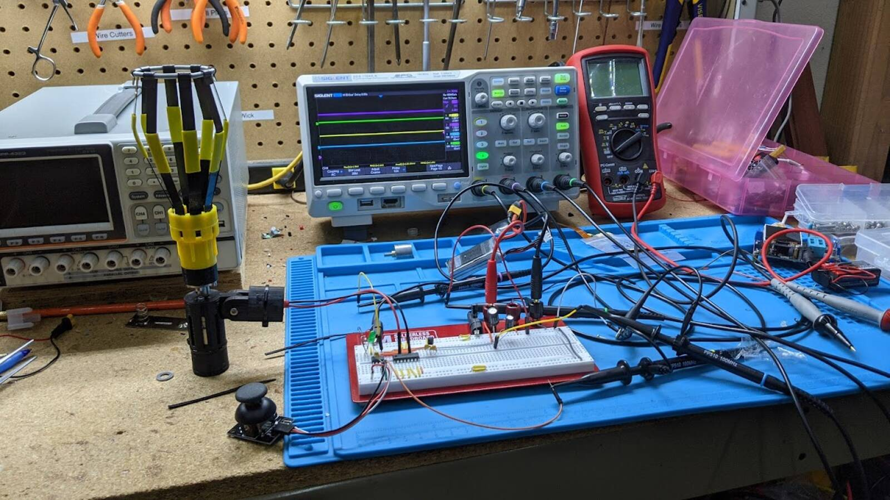

# Light Bulb Changer

Do you have hard-to-reach light bulbs?  If so, then you are perhaps familiar
with this device:

It threads on the end of a pole and extends your reach.  A problem is one of
mechanics.  If you can't get your pole square to the bulb, the effectiveness of
the holder decreases rapidly.  Imagine trying to use this thing at a 90 degree
angle to the bulb.  That is the exact situation I found myself in: 

OK. Just get a tall ladder, move that table, make that suspicious call
confirming my life insurance details and up I go.  Just kidding, I instead
used this as an excuse for another maker project.

I spent way more time on this than the ladder would have taken.  Then again, it
was quite a bit of fun and now I have a useful tool on-hand ready to square off
against the next light bulb challenge.  Lucky for you, you can build one of
these things in a fraction of the time it took me because all of the design,
modeling, and testing steps are done and you can just use them.  Heck, I
even include a walkthrough below.

Of course if you want extra challenge, feel free to mod up the design below to
match your favorite parts and techniques.  Have it play inspirational music, add
Bluetooth for some reason... Your imagination, skill, time and budget are your
only limits.

If you don't have a 3D printer, hope is not lost.  You can always use a project
box, parts from the hardware store and plenty of zip ties to get things done old
school.

## Step 1: Parts

Here is what we are building:

The middle unit is a motorized driver that the light bulb changer screws onto.
It then screws on a pole.  Now you have both a motor and a way to change the
angle.

 
There is also a control box that goes on the other end of the pole.  This is how
you control the motor:

### Parts you'll need include:

   1. **A [geared brushed motor](https://www.amazon.com/gp/product/B0728HDH45)**.  These
      are around $6 on Amazon, probably cheaper other places.  I went with 200
      RPM which is a bit more than 3 rotations/second at 12V.  This seemed about
      right.
   2. **A microcontroller**. I went with the [ATTiny85](https://www.sparkfun.com/products/9378)
      The hardest thing about this project might be loading firmware on it if you
      have not done so before.  But it's well-documented on the internet and once
      you get it working once, it will be turn-key after that.
   3. **A [L293D](https://www.adafruit.com/product/807) H-bridge motor driver**.
      This turns the puny waveforms the ATTiny85 can generate into power boosted
      energy waves that can drive a motor at variable speeds and in either forward
      or reverse.
   4. **A broomstick** for mounting
   5. **[Enough wire](https://www.amazon.com/BNTECHGO-Flexible-Conductor-Resistant-Extension/dp/B077X9MVWG)**
      to reach all the way down the broomstick.
   6. **Zipties** to secure the control module to the broomstick.
   7. **[Sony PS2 thumbstick](https://www.amazon.com/HiLetgo-Controller-JoyStick-Breakout-Arduino/dp/B00P7QBGD2)**
      which is basically a thumb-friendly potentiometer. Any
      potentiometer that you can see yourself using as a control could also work.
   8. **A power source**.  You'll need around 12V and enough current to keep the motor
      happy.  A [3S lipo battery](https://www.amazon.com/TATTU-Battery-650mAh-Torrent-Lizard/dp/B071GBGBB4)
      (450-1800 mAh) fits this bill perfectly, but you'll
      also need a special charger.  You can also stack 9 (or more) AA batteries in
      series.  A DC wall wart could also work.
   9. **Connectors for the power source**.  With a small 3S lipo, I really like
      the [XT30 connector](https://www.amazon.com/10Pairs-Upgrade-Connector-Female-Battery/dp/B08P5HVMYT)
      and that is what the 3D printed case is designed to handle without
      "manual modifications"
   10. **PCB prototyping board** - Technically optional as there are so many way to construct a circuit.
       But [30x70 perf board](https://www.amazon.com/ELEGOO-Prototype-Soldering-Compatible-Arduino/dp/B072Z7Y19F)
       is my personal option for a good option here.
   11. **Status LED(s)**.  I went with a two-color LED which has red and green
       channels.  You can also go with two separate LEDs of any color you want with minimal changes.
   12. **Some current limiting resistors** for the LEDs.  Values are not critical -
       something in the 470 to 2k range will work with lower values resulkting in
       brighter LEDs.
   13. **A 5V regulator**.  I went with the LP2950Z but [nearly anything](https://www.sparkfun.com/products/107)
       will work here. 
   14. **Some capacitors**.  The DC motor is a noisy load for the battery and the 5V
       regulator will see this noise on it's input.  Caps on each side of the
       regulator will help keep the noise off the 5V electronics  I went with
       500+ uF on the input side and another 100 uF on the output side, which is
       likely overkill.
   15. **Connectors** for the PS2 thumstick and motor wire.  I used standard 2.54mm pitch
       headers.  Anything you have could work.

### Tools you'll need:

   1. **A 3D printer** if you want print the motor housing and controller box. If you
      don't have one you can come up with an alternate holder for the motor
      (ziptie, etc)
   2. **A Breadboard** if you want to verify operation before committing the parts with
      solder.

## Step 2: Electronics Build

The ordering is not strict here but I like getting the electronics working
first.  A breadboard is a  good way to wire things up and get the assurance
that, as long as I wire it up competently, the final build will work.

Here is the schematic:

So how does this thing work?

   * You move the potentiometer (PS2 thumstick)
   * The microcontroller notes the new potentiometer state (via PB4)  and uses
     it to update the motor direction and speed. 
   * The direction and speed are communicated via a PWM signal (via PB0) which
     tells the motor how fast to spin via the only language it understands: power.
     It also needs to send a bit (via PB1 and PB2) that tells the motor
     controller whether to go left or right.
   * The motor controller takes the weak PWM signal from the microcontroller and
     puts the full force of the battery pack behind it (e.g. 12V and whatever
     current the motor asks for - assuming it's not too much..)
   * The bottom left of the circuit is just the 5V regulator and some supporting
     capacitors to filter out motor noise.

You can probably imagine the rest - adapter on motor, light bulb changer on
adapter and light.  Turning, problems being solved, happy time.

First, you will need to program the ATTiny85.  There are many tutorial online and
several methods.

 
